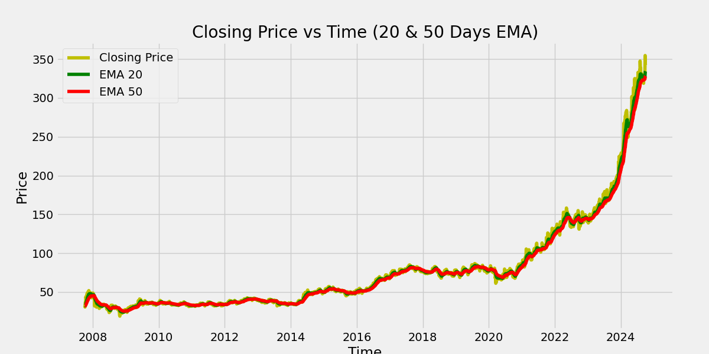
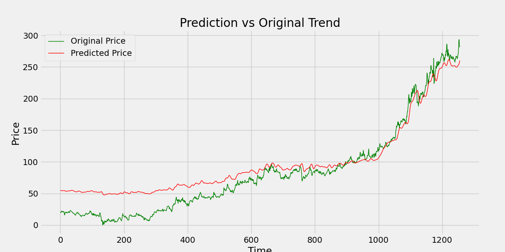

---

# 📈 Stock Price Prediction Web App


A **Flask-based web application** that predicts stock prices using a **Deep Learning model** (LSTM) and visualizes the stock trends with **Exponential Moving Averages (EMA)**. It also allows users to **download stock data** as CSV.

---

## 🎯 Features

* Predict future stock prices using a trained LSTM model.
* Visualize **closing prices** with 20, 50, 100, and 200 days EMAs.
* Compare **predicted vs actual stock prices** in a chart.
* Download historical stock dataset in CSV format.
* Supports **all stocks listed in Yahoo Finance**.
* Interactive and easy-to-use **web interface**.


---

## 🛠 Technology Stack

* **Backend**: Python, Flask
* **Frontend**: HTML, CSS, Bootstrap
* **Data Processing**: Pandas, NumPy
* **Visualization**: Matplotlib
* **Machine Learning**: Keras, TensorFlow
* **Data Source**: Yahoo Finance via `yfinance`
* **Scaling**: Scikit-learn's `MinMaxScaler`

---

## 📁 Project Structure

```
stock-prediction-app/
│
├── static/                  # Images, GIFs, CSV downloads
├── templates/               # HTML templates
│   └── index.html
│
├── stock_dl_model.h5        # Pre-trained LSTM model
├── app.py                   # Flask application
└── README.md
```

---

## 🚀 Installation

1. **Clone the repo**

```bash
git clone https://github.com/yourusername/stock-prediction-app.git
cd stock-prediction-app
```

2. **Create virtual environment**

```bash
python -m venv venv
source venv/bin/activate  # Linux / Mac
venv\Scripts\activate     # Windows
```

3. **Install dependencies**

```bash
pip install -r requirements.txt
```

> `requirements.txt` should include:
>
> ```
> Flask
> pandas
> numpy
> matplotlib
> yfinance
> keras
> tensorflow
> scikit-learn
> ```

4. **Run the app**

```bash
python app.py
```

5. Open your browser at `http://127.0.0.1:5000`

---

## 🖼 Demo






---

## ⚙️ How It Works

1. Enter a stock ticker in the web form (default: `POWERGRID.NS`).
2. The app fetches historical data from **Yahoo Finance**.
3. EMAs are calculated for **20, 50, 100, 200 days**.
4. Data is scaled and fed into the **LSTM model** to predict stock prices.
5. Charts and CSV download link are generated dynamically.


## 📜 License

This project is licensed under the MIT License.

```
MIT License

Copyright (c) 2025 Your Name

Permission is hereby granted, free of charge, to any person obtaining a copy
of this software and associated documentation files (the "Software"), to deal
in the Software without restriction, including without limitation the rights
to use, copy, modify, merge, publish, distribute, sublicense, and/or sell
copies of the Software, and to permit persons to whom the Software is
furnished to do so, subject to the following conditions:

The above copyright notice and this permission notice shall be included in all
copies or substantial portions of the Software.

THE SOFTWARE IS PROVIDED "AS IS", WITHOUT WARRANTY OF ANY KIND, EXPRESS OR
IMPLIED, INCLUDING BUT NOT LIMITED TO THE WARRANTIES OF MERCHANTABILITY,
FITNESS FOR A PARTICULAR PURPOSE AND NONINFRINGEMENT. IN NO EVENT SHALL THE
AUTHORS OR COPYRIGHT HOLDERS BE LIABLE FOR ANY CLAIM, DAMAGES OR OTHER
LIABILITY, WHETHER IN AN ACTION OF CONTRACT, TORT OR OTHERWISE, ARISING FROM,
OUT OF OR IN CONNECTION WITH THE SOFTWARE OR THE USE OR OTHER DEALINGS IN THE
SOFTWARE.
```

---
